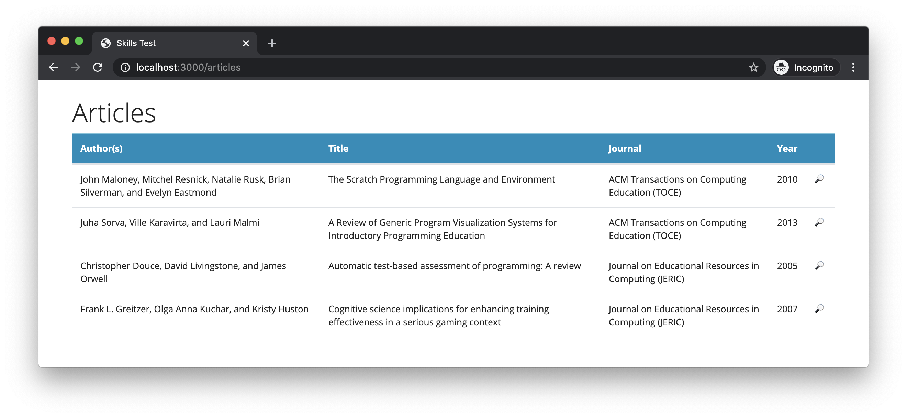
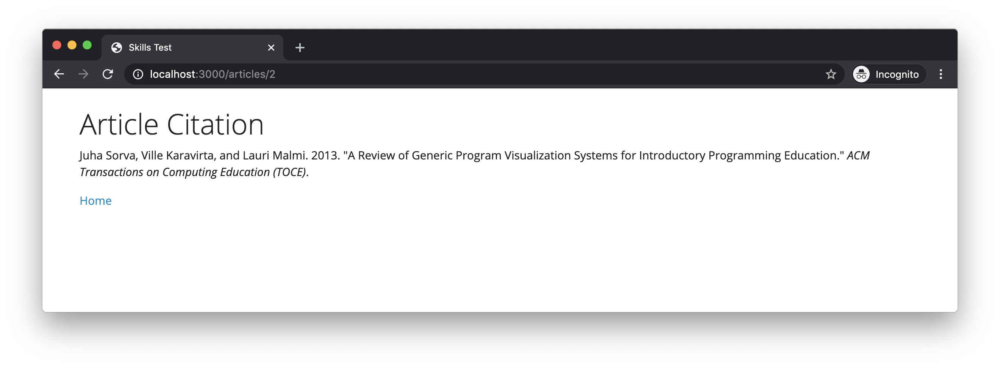
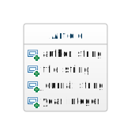

# Skills Test S3

## Part 1. Starting the Test

1. Start the screen-capture recording.

1. In your web browser, google the query string "`current time`", so the current time is displayed and captured in the recording.

1. In the terminal, change directory into the skills test project directory and verify that the working directory is clean:

    ```bash
    git status
    ```

    If there are any uncommitted changes or any untracked files in your working directory, then you will need to do something about them before proceeding.

1. In the terminal, download and checkout the branch for the test:

    ```bash
    git fetch
    git checkout --track origin/comp7012-s03
    ```

1. Initialize the project by doing the following:
   1. Install the Gems for the project using `bundle`.
   1. Install the JavaScript dependencies for the project using `yarn`.

1. Reset the database using this command:

    ```bash
    rails db:migrate:reset
    ```

Do nothing further at this point, and read on.

## Part 2. Development Tasks

For this test, you have been given a partially complete Rails app, and it is your job to complete the app.

The web app is currently broken (so there's no point in trying to run it at this point).

The app manages journal article citations, and it is supposed to display the following `index` page when the URL <http://localhost:3000/articles> is entered into the browser:



Clicking the magnifying glass (🔎) hyperlink next to an article should open a `show` page for the article. For example, clicking the link for the second article should bring up a page that looks like this:



To complete this app, you must do the following:

1. Generate an `Article` model class and migration, as per this class diagram:

   

   **Caution!** The names and types must match this diagram exactly (case sensitive).

1. Write code that creates seed data as per the table of article data below. (Note that we provided the table below to enable copying and pasting of attribute values, and thus, to speed up data entry.)

1. Migrate and seed the database, and run the app. You should see that the `index` page is working, but the `show` page is still incomplete.

1. Complete the existing `show` controller action and view. The data displayed in the `show` page must be retrieved from the database by the controller and passed to the view for rendering.

Here is the seed data for the app:

| Author(s)  |	Title     |	Journal    |	Year      |
| ---------- | ---------- | ---------- | ---------- |
| John Maloney, Mitchel Resnick, Natalie Rusk, Brian Silverman, and Evelyn Eastmond | The Scratch Programming Language and Environment | ACM Transactions on Computing Education (TOCE) | 2010 |
| Juha Sorva, Ville Karavirta, and Lauri Malmi | A Review of Generic Program Visualization Systems for Introductory Programming Education | ACM Transactions on Computing Education (TOCE) | 2013 |
| Christopher Douce, David Livingstone, and James Orwell | Automatic test-based assessment of programming: A review | Journal on Educational Resources in Computing (JERIC) | 2005 |
Frank L. Greitzer, Olga Anna Kuchar, and Kristy Huston | Cognitive science implications for enhancing training effectiveness in a serious gaming context | Journal on Educational Resources in Computing (JERIC) | 2007 |

## Part 3. Test Submission

Once you've completed all of the above, submit your work by doing the following:

1. Commit all your changes to the local repo:

    ```bash
    git add -A
    git commit -m "Completed comp7012-s03"
    ```

1. Generate a ZIP archive of your project by running the following command from within the top-level folder of your project's working directory:

    ```bash
    git archive -o ../comp7012-s03-submission.zip --prefix=comp7012-s03-submission/ HEAD
    ```

    This command should result in a file `comp7012-s03-submission.zip` being created in your `workspace` folder.

1. Upload this ZIP file to the [eCourseware](https://elearn.memphis.edu/) dropbox labeled `comp7012-s03 zip (no video)`.

    **This step must be completed by the end of the test time.**

1. Stop your screen-capture recording such that a video file containing the recording is now created.

1. Upload your video recording to the [eCourseware](https://elearn.memphis.edu/) dropbox labeled `comp7012-s03 video only`. Click the "`Record Video`" link to upload your video.

    A 15-minute grace period is given beyond the end of the test time for the submission of your video.

1. Close your laptop, and sit quietly until the test period is over. You may **NOT** use your laptop or any device while you wait. However, you may, for example, read a book that you brought with you.
